# Nexus RDM

A modern, fast remote-desktop manager for Windows. Hold every SSH and RDP connection you care about in a single tabbed window — keep them organized, watch their state at a glance, and import whole clusters from Proxmox, Hyper-V, or a network sweep.

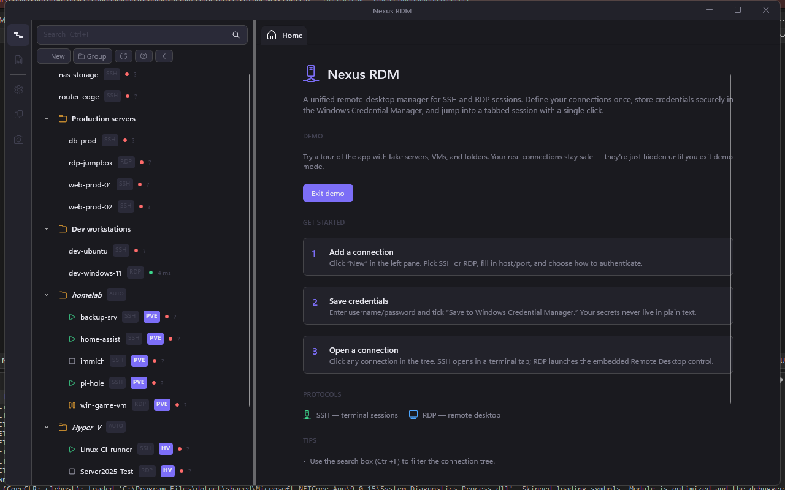

A short tour through the demo mode (synthetic data only — no real hosts):


The GIF above runs at a reduced frame rate to keep the file size reasonable. For sharper playback there's also [`demo-tour-hq.gif`](docs/screenshots/demo-tour-hq.gif) (tracked via Git LFS) and [`demo-tour.mp4`](docs/screenshots/demo-tour.mp4) — same recording, MP4 is ~30× smaller than GIF for the same visual quality. Click through to view the MP4; GitHub's repo README renderer doesn't embed it inline.

> Screenshots, GIFs, and the MP4 in this README are auto-generated. See [`tools/NexusRDM.DemoRecorder`](tools/NexusRDM.DemoRecorder) — it drives the app via FlaUI in demo mode and writes everything under `docs/screenshots/`. Resolution is preserved at full capture size (1280×800); the recorder only drops fps when shrinking, so terminal text and field labels stay legible.

---

## What you get

- **One window, every session.** SSH and RDP both run as tabs in the same Tab View. Pop any tab into its own window when you want full-screen, dock it back when you're done.
- **Folders, search, and ping at a glance.** Group connections however you want (or auto-group from a sync). The tree shows live connection state, an SSH/RDP badge, latency, and an at-a-glance running/stopped/paused icon for managed VMs.
- **Saved credentials in Windows Credential Manager.** No JSON-on-disk passwords, no plaintext-anywhere. The app stores secrets through the OS vault and looks them up on connect.
- **Proxmox cluster import.** Register a PVE cluster once, every VM and container shows up automatically. The importer probes ports 22 / 3389 to pick the right protocol per VM, reads guest-agent IPs (or LXC `net0`), respects per-VM `#nexus:*` tags, and hard-deletes rows when the VM disappears from the cluster.
- **Local Hyper-V import.** Same shape as Proxmox, but for the local host: enumerate via WMI, get the IP from KVP exchange, run power actions (start / shutdown / reboot / save) right from the tree, or open the Microsoft `vmconnect` console.
- **Network discovery.** Sweep a `/24` LAN segment for SSH and RDP listeners, dedup against your existing connections, and drop the hits into a "Discovered" folder.
- **Theme + UX polish.** Eight built-in themes including a fully editable Custom palette, configurable hotkeys, font-size knob, adjustable sidebar width, and a status row that wraps long error messages instead of truncating them.

---

## Install / run

1. Grab the latest **NexusRDM-vX.Y.Z-win-x64.zip** from [Releases](../../releases).
2. Unzip anywhere.
3. Run `NexusRDM.exe`. Self-contained — no .NET install needed.

Or build from source: open `NexusRDM.slnx` in Visual Studio 2022, set `NexusRDM` as startup, F5.

---

## Connecting to things

### Make or edit a connection

Click **+ New** in the sidebar, fill in name + host + protocol, hit save. The credential row defaults to "save in vault"; turn it off if you'd rather get prompted every time. The Edit panel slides in from the right and shows protocol-specific options below the common fields.

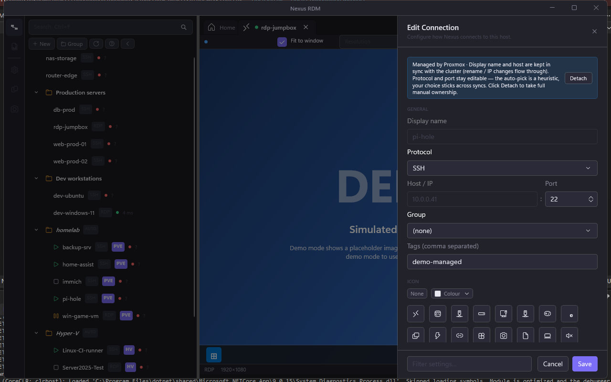

Switch to **RDP** and the panel reveals resolution, color depth, audio mode, and gateway settings:

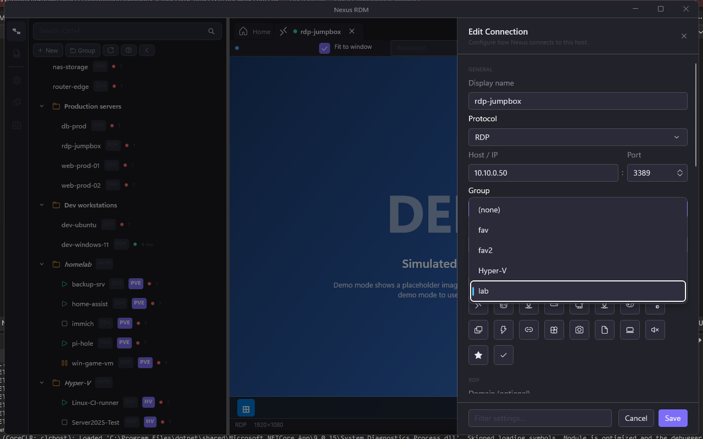

### Connect to something

Open an SSH session and you get a real terminal pane. Demo mode shows a canned bash session so you can poke around without a real host.

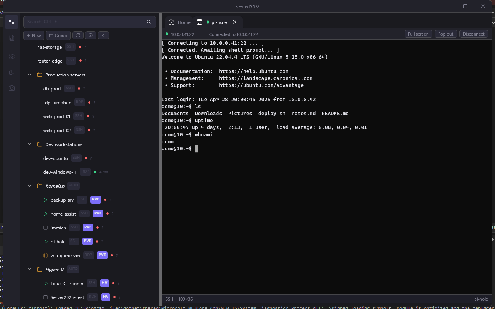

RDP sessions render the embedded mstscax control inside the same tab. In demo mode you get a placeholder image instead of opening a real connection — same shape, same toolbar, no host required.

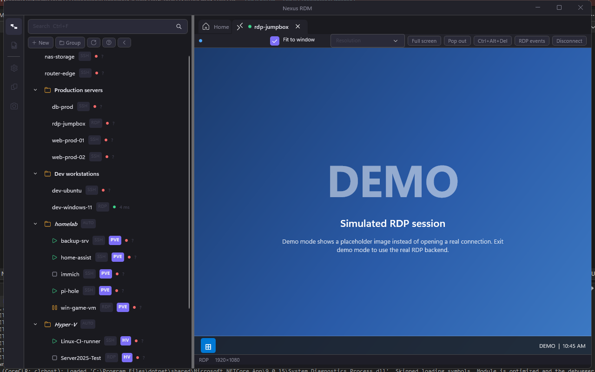

### Right-click for everything else

Every row's right-click menu gives you Connect / Edit / Delete. Folders give you New connection in group / Delete group / (and if it's a managed folder) Sync now.

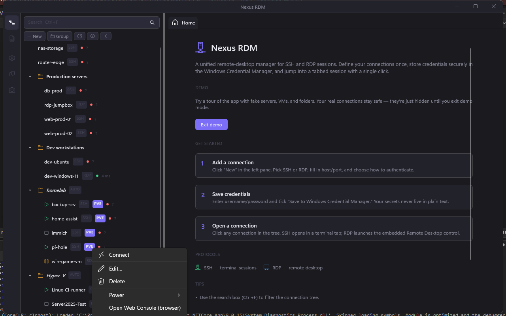

---

## Proxmox sync

Settings → **Proxmox sources** → **+ Add cluster…**

Give it the cluster URL, an API token (preferred — `USER@REALM!TOKENID` + the secret) or a username/password, and click **Test connection**. Token gotcha: PVE tokens default to `Privsep=1`, which means the *token* needs its own ACL row in **Datacenter → Permissions** (granting the role to the underlying user is not enough). The Test button surfaces this exact case if it sees zero VMs come back.

Once the source is registered, **Sync now** pulls every VM into a folder named after the cluster. The folder is italic + tagged `AUTO` so you know it's owned by the sync — manual edits to display name or host get overwritten on the next pass, but **Protocol** and **Port** stay user-editable. The auto-pick can be wrong on Linux VMs running RDP or Windows hosts running OpenSSH; flip the protocol once and your choice sticks.

Right-click a synced VM for **Power** (Start / Shutdown / Reboot / Stop / Reset), **Open Web Console** (launches PVE's noVNC in your default browser), or **Detach from Proxmox** if you want manual ownership of that row.

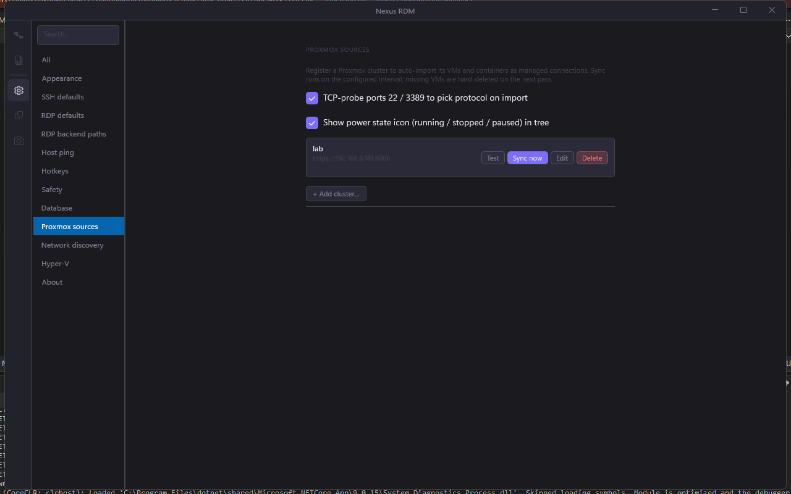

A small colored icon on each row shows the VM's power state — green ▶ running, gray ■ stopped, amber ⏸ paused. Hide it from Settings if it clutters narrow trees.

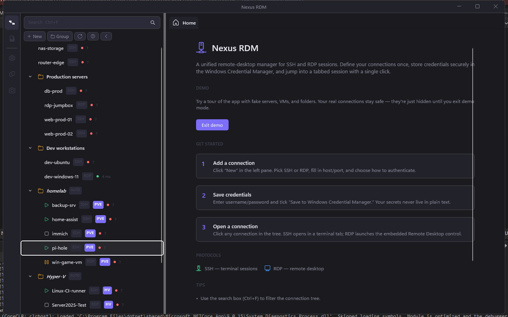

---

## Hyper-V (local)

Settings → **Hyper-V** → flip on **Enable Hyper-V sync**, hit **Test connection**.

You need to be in the local **Hyper-V Administrators** group (same as `Get-VM` in PowerShell — no elevation required). If you're not, the Test diagnostic tells you the exact PowerShell command to add yourself, and reminds you that group memberships only land in your access token after a fresh logon.

Synced VMs show up under a `Hyper-V` folder. Right-click a VM for **Power** actions (via WMI's `RequestStateChange`), **Open in vmconnect** (launches Microsoft's console), or **Detach**.

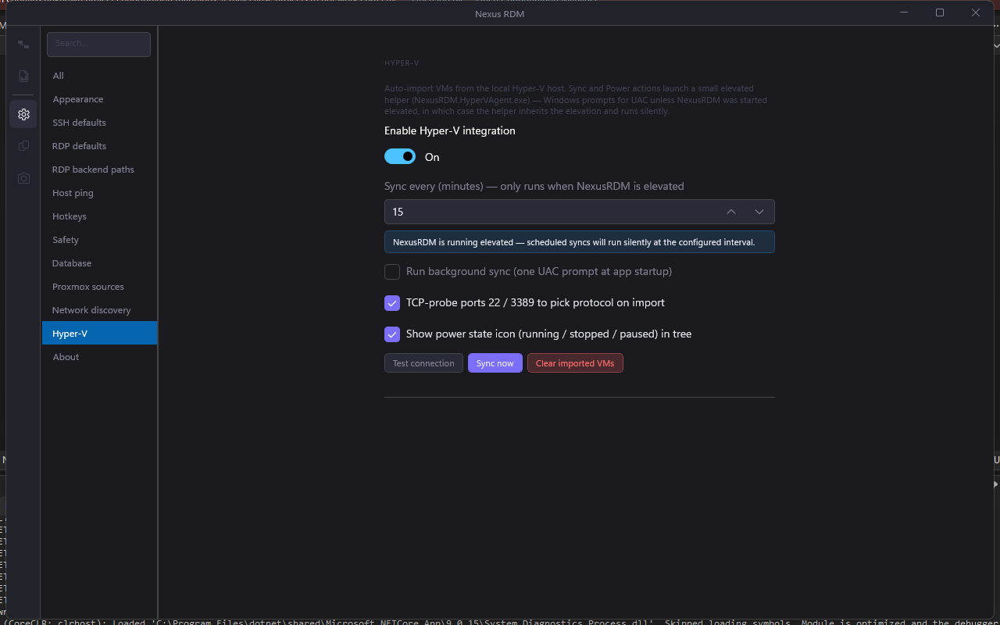

---

## Network discovery

Settings → **Network discovery** → set a `/24` subnet → **Scan now**.

It TCP-probes ports 22 and 3389 across the 256 addresses, optionally reverses-DNS the hits, and drops anything new under a `Discovered` folder. Dedup is by `host:port`, so a re-scan never produces duplicates — and existing manual rows are left alone.

The folder is auto-managed: turn the toggle off and the folder + its rows + their saved credentials go away. **Clear discovered devices** wipes the contents but keeps the folder for the next sweep.

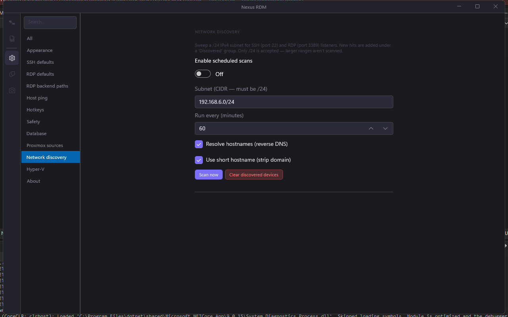

---

## Themes

Eight built-in palettes including the original Dracula default. Pick **Custom** to edit every color individually with a color-picker per slot — changes apply live so you can dial in the exact look you want.

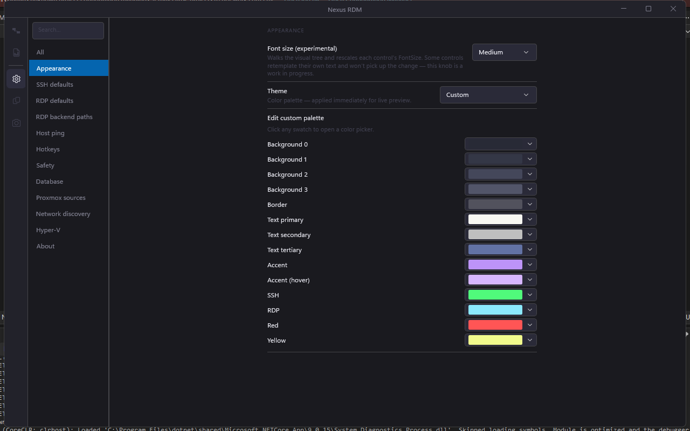

---

## Keyboard shortcuts

Configurable in **Settings → Hotkeys**. Defaults:

| Action | Shortcut |
|---|---|
| Next session tab | `Ctrl+Tab` |
| Previous session tab | `Ctrl+Shift+Tab` |
| Toggle full-screen | `F11` |
| Pop out / dock active tab | `Ctrl+Shift+P` |
| Search the connections tree | `Ctrl+F` |

Each one has its own enable checkbox if you'd rather free up the binding.

---

## Settings reference

Everything is auto-saved — there's no Save button, every change persists immediately.

- **Appearance** — font size (small / medium / large), theme picker, custom palette editor.
- **SSH defaults / RDP defaults** — port, default resolution, color depth, audio mode, redirection toggles, gateway settings.
- **RDP backend paths** — override `mstsc.exe` or `mstscax.dll` if you want to side-load a custom version.
- **Host ping** — on/off toggle, interval (5–600s), show-latency-in-tree.
- **Hotkeys** — see above.
- **Safety** — confirm-before-closing-active-sessions, audit-log retention.
- **Database** — open data folder, export everything to JSON, reset (also wipes vault credentials — re-launch starts fresh).
- **Proxmox sources** — list / add / edit / delete clusters; per-source Test / Sync / Sync interval. Global toggles: TCP-probe ports for protocol picking, show power-state icon.
- **Network discovery** — see [above](#network-discovery). Reverse-DNS option, short-hostname-vs-FQDN.
- **Hyper-V** — see [above](#hyper-v-local).

---

## Where things live on disk

| What | Where |
|---|---|
| Database (connections, groups, audit) | `%LocalAppData%\NexusRDM\connections.db` |
| Settings | `%LocalAppData%\NexusRDM\settings.json` |
| Logs | `%LocalAppData%\NexusRDM\logs\nexus-YYYY-MM-DD.log` |
| Crash dumps | `%LocalAppData%\NexusRDM\crash.log` |
| Credentials | Windows Credential Manager (Generic credentials, prefixed) |

The database can be safely deleted (or moved between machines) — the app rebuilds the schema on next launch via EF Core migrations.

---

## Troubleshooting

**Proxmox sync returns 0 VMs.** Your token has `Privsep=1` (the default) and no ACL row of its own. Open the Proxmox UI → **Datacenter → Permissions → Add → API Token Permission**, pick the token, give it `PVEAuditor` on `/`. Sync again.

**Hyper-V sync returns 0 VMs.** The most common cause is being in the `Hyper-V Administrators` group but not having signed out since being added — Windows only refreshes group memberships in your access token at fresh logon. Sign out, sign back in, retry. PowerShell's `whoami /groups | findstr Hyper-V` is authoritative.

**RDP session fails with credential errors.** If the connection is set to "save in vault", make sure the saved username/password actually log in via mstsc directly. The app uses your stored credential verbatim.

**Some long status messages get cut off.** Resize the window (or drag the sidebar splitter) — long error text wraps into the available width.

---

## MSIX package (sideload install)

The default build is unpackaged — a self-contained zip you double-click. For Start-Menu integration, app updates via deployment tooling, or store-style installs, build a signed `.msix` instead:

```powershell
# Self-signed dev cert is auto-created on first run; output lands in
# artifacts\msix\.
tools\build-msix.ps1
```

To install the resulting package on the dev box, the cert needs to be trusted first:

```powershell
# One-time: export the dev cert and trust it locally.
$cn = "CN=Gus Catalano"
$cert = Get-ChildItem Cert:\CurrentUser\My | Where-Object Subject -eq $cn | Select-Object -First 1
Export-Certificate -Cert $cert -FilePath nexusrdm-dev.cer
Import-Certificate -FilePath nexusrdm-dev.cer -CertStoreLocation Cert:\LocalMachine\TrustedPeople

# Install the package.
Add-AppxPackage -Path artifacts\msix\<NexusRDM_*.msixbundle>
```

For real release builds, replace the dev cert with a code-signing cert from a trusted CA (or a properly-trusted internal CA), pass its thumbprint, and update `Package.appxmanifest`'s `<Identity Publisher="…">` to match the cert's subject:

```powershell
tools\build-msix.ps1 -Thumbprint <YOUR-CERT-THUMBPRINT>
```

The script also auto-generates the tile / splash PNGs from `Assets\AppIcon.ico` if they're missing, so first-time builds don't need separate asset work.

### Microsoft Store submission

The Store re-signs uploads with its own cert (`CN=119E0257-3B74-437C-A728-AC7C50256853`), so locally-signed packages are rejected at ingestion. Build an unsigned `.msixupload` instead:

```powershell
tools\build-msix.ps1 -ForStore -Version 1.0.0.42
```

CI does this automatically on every push to `main` and on every `v*` tag — see `.github/workflows/ci.yml`'s `msix-store` job. Versioning:

- **Branch push / `workflow_dispatch`** → `1.0.0.<github-run-number>` so every build is unique (Store rejects re-uploads of an existing `Identity Version`).
- **Tag push (`v1.2.3`)** → `1.2.3.0` (uses the tag's semver verbatim).

Pull the `nexusrdm-msix-<version>` artifact from the workflow run, then upload the `.msixupload` to **Partner Center → your app → Packages**. The first submission also needs:

- Listing copy + screenshots (1366×768 minimum + Store-tile sizes).
- Privacy policy URL (required because the app uses `internetClient`).
- Age rating questionnaire.
- Justification for the `allowElevation` capability — the elevated `NexusRDM.HyperVAgent.exe` only runs on user-initiated Sync / Power actions, with a UAC prompt every time.

## Building from source

```bash
git clone https://github.com/guscatalano/NexusRDM
cd NexusRDM
# Open NexusRDM.slnx in Visual Studio 2022, F5
# Or:
dotnet restore src/NexusRDM/NexusRDM.csproj
msbuild src/NexusRDM/NexusRDM.csproj /p:Configuration=Release /p:Platform=x64
```

Targets `.NET 9` + `Windows App SDK 1.7`, self-contained build. CI on every PR (`.github/workflows/ci.yml`) runs the full test suite (Core + Data + ViewModels) and produces a debug artifact.

---

## Credits

Built by [**Gus Catalano**](https://github.com/guscatalano) with help from Claude.
